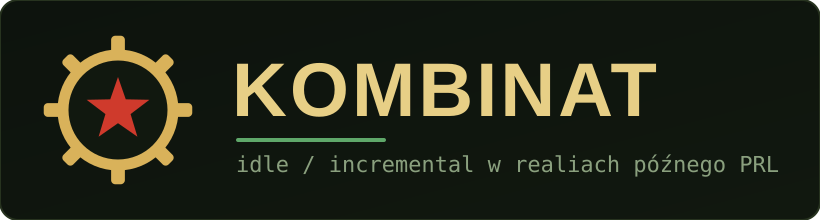

<p align="center">
  
</p>

<p align="center">
  
  
  
  
  
</p>

<p align="center">
  <b>Kombinat</b> to gra <i>idle / incremental</i> osadzona w realiach <b>późnego PRL</b> (lata ~1970–1990).<br>
  Budujesz drabinę polskiej informatyki — od liczydła po „spółkę z o.o." — w klimacie kolejek, talonów,
  cinkciarzy i propagandy sukcesu.
</p>

---

##  Co w środku

| | |
|---|---|
|  **Ekonomia i produkcja** | Dwa zasoby (cykle i dewizy), 11 maszyn polskiej informatyki, klikanie i automatyzacja. |
|  **Ponad 1000 ulepszeń** | Ulepszenia główne, drzewo Dziedzictwa i kamienie milowe — „żeby się nie kończyły". |
|  **Drzewo Dziedzictwa** | Trwałe po Denominacji (prestiż); głębokie, odsłaniające się węzły z rosnącą liczbą poziomów. |
|  **Minigry i mechaniki** | Kantor (giełda), „Taśma" (wczytywanie z magnetofonu), Załatwianie (łapówki). |
|  **Zjazd PZPR i doktryny** | Wybór „linii" na pięciolatkę — z prawdziwymi kompromisami (m.in. gierkowski boom‑bust). |
|  **Dyplomacja bloków** | Relacje z krajami RWPG i Zachodu przesuwają koszty, produkcję i dopływ dewiz. |
|  **Kadra** ·  **Osiągnięcia** ·  **Zdarzenia** | Werbunek postaci, setki osiągnięć i modalne mini‑historyjki w klimacie epoki. |
|  **Studio DLC** | Osobna strona do tworzenia, walidacji, pakowania i pieczętowania paczek DLC. |
|  **Postęp offline** ·  **Zapis `.k7`** | Gra liczy się także pod nieobecność; zapis lokalny, szyfrowany, z eksportem/importem. |

##  Struktura repo (Gra i Studio razem)

To **jedno repozytorium (monorepo)** — i tak ma zostać. Gra i Studio dzielą ten sam, wersjonowany moduł
schematu (`@kombinat/shared`), więc trzymanie ich osobno rozjechałoby ich walidację. Hostowane są jako
**dwie osobne statyczne strony**, ale źródło żyje tu razem.

```
packages/
├─ shared/   @kombinat/shared — JEDNO ŹRÓDŁO PRAWDY: schemat treści, rejestr ID,
│            słownik efektów, bezpieczny parser formuł (bez DOM). Używają go GRA i STUDIO.
├─ game/     @kombinat/game   — sama gra (Svelte 5, PWA). Port dev 5173.
└─ studio/   @kombinat/studio — Studio DLC (osobna strona). Port dev 5174.
docs/        PLAN.md, DLC.md, STUDIO.md, ULEPSZENIA.md, STATUS.md
```

##  Uruchomienie

```bash
npm install            # instalacja (workspaces)

npm run dev            # GRA          → http://localhost:5173
npm run dev:studio     # Studio DLC   → http://localhost:5174

npm test               # testy (shared + gra + studio)
npm run typecheck      # kontrola typów
npm run build          # produkcyjny build gry
npm run build:studio   # produkcyjny build Studia
```

##  Dokumentacja

Plany i kontrakty żyją w `docs/` (są nadrzędne wobec kodu):

- **[PLAN.md](docs/PLAN.md)** — plan budowy gry (fazy).
- **[DLC.md](docs/DLC.md)** — kontrakt dla twórców paczek DLC.
- **[STUDIO.md](docs/STUDIO.md)** — plan i zasady Studia DLC.
- **[ULEPSZENIA.md](docs/ULEPSZENIA.md)** — plan rozbudowy ulepszeń.
- **[STATUS.md](docs/STATUS.md)** — żywy stan prac.

##  Wersja i historia zmian

Aktualna wersja: **0.4.3** (pre‑1.0). Pełna lista zmian: **[CHANGELOG.md](CHANGELOG.md)**.
W grze wersję i historię zmian widać w oknie **Statystyki**.

##  Status

🚧 **To nie jest jeszcze pełna wersja gry.** Projekt jest w aktywnej budowie — liczby (koszty, mnożniki)
są startowe i strojone na bieżąco, a kolejne mechaniki dochodzą fazami.

---

<p align="center"><sub>© 2026 NightBossman · projekt w budowie · ikony: <a href="https://lucide.dev">Lucide</a></sub></p>
